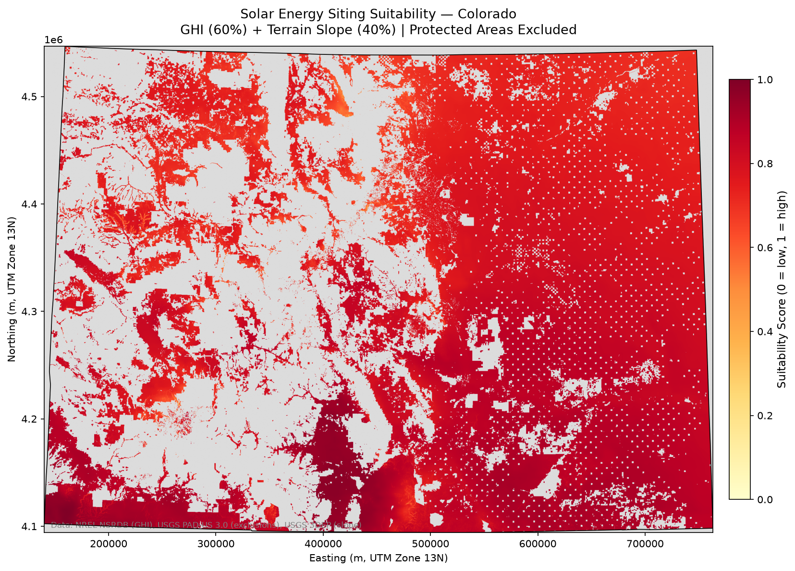

# Solar Energy Siting Suitability Model — Colorado

Multi-criteria geospatial suitability analysis for utility-scale solar energy
deployment across Colorado using open-source Python and publicly available datasets.

## Results



High-suitability zones (red/orange) in southeastern Colorado plains.
Protected areas and steep terrain correctly excluded.

## Methods

| Criterion         | Weight | Source               |
|-------------------|--------|----------------------|
| GHI (irradiance)  | 60%    | SOLARGIS GHI         |
| Slope (terrain)   | 40%    | USGS 3DEP 1/3 arc-sec |
| Exclusion zones   | Hard mask | USGS PAD-US 3.0      |

**CRS:** EPSG:32613 (UTM Zone 13N)
**Resolution:** 1 km
**Extent:** Colorado state boundary (US Census TIGER 2022)

## Repository Structure
## Setup

```bash
conda create -n gds python=3.11
conda activate gds
conda install -c conda-forge geopandas rasterio numpy matplotlib jupyter gdal
git clone https://github.com/atifanindarahman/solar-siting-colorado.git
cd solar-siting-colorado
```

Download datasets per instructions in the notebook, then:

```bash
python src/main.py
```

## Data Sources

- SOLARGIS GHI: https://solargis.com/resources/free-maps-and-gis-data?locality=usa
- USGS PAD-US 3.0: https://www.usgs.gov/programs/gap-analysis-project
- USGS 3DEP: https://apps.nationalmap.gov/downloader/
- US Census TIGER: https://www.census.gov/geographies/mapping-files

## Author

Atif Aninda Rahman — MS GIS, University of Denver
Atifaninda56@gmail.com
